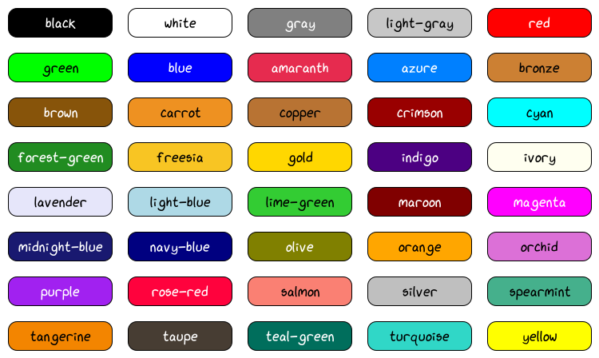

----------------
Basic Data Types
----------------

~~~~~
Color
~~~~~

.. autoclass:: viren2d.Color
   :autosummary:
   :autosummary-nosignatures:
   :members:
   :undoc-members:

~~~~~~~~~~~
Color Names
~~~~~~~~~~~

.. autofunction:: viren2d.color_names

**Color Name Cheat Sheet:**

~~~~~~~~~
Vector 2D
~~~~~~~~~

.. warning::
   TODO doc

.. autoclass:: viren2d.Vec2d
   :autosummary:
   :autosummary-nosignatures:
   :members:

~~~~~~~~~
Vector 3D
~~~~~~~~~

.. warning::
   TODO doc

.. autoclass:: viren2d.Vec3d
   :autosummary:
   :autosummary-nosignatures:
   :members:

~~~~~~~
Ellipse
~~~~~~~

.. warning::
   TODO doc overloaded ctor

.. autoclass:: viren2d.Ellipse
   :autosummary:
   :autosummary-nosignatures:
   :members:

**Example:**

   .. figure:: ../images/ellipse.png
      :width: 600
      :alt: Exemplary ellipses
      :align: center

The code listing to create this visualization is shown in the
:ref:`tutorial section on ellipses<tutorial-draw-ellipses>`.

~~~~~~~~~
Rectangle
~~~~~~~~~

.. autoclass:: viren2d.Rect
   :autosummary:
   :autosummary-nosignatures:
   :members:

~~~~~~~~~~~
ImageBuffer
~~~~~~~~~~~

.. warning::
   TODO doc

TODO add conversion examples to the tutorial (where they actually belong) & only include class documentation here!
TODO :ref:`convert into types used in common image processing libraries <tutorial-conversion>`

.. autoclass:: viren2d.ImageBuffer
   :autosummary:
   :autosummary-nosignatures:
   :members:

