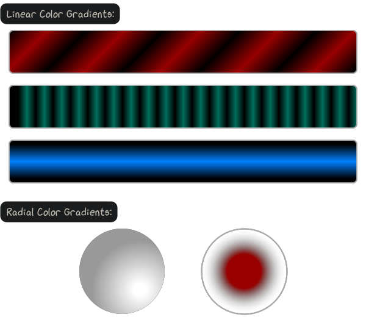

---------------
Color Gradients
---------------

Color gradients are smooth blendings of different colors, specified by *color
stops* along a *control vector*. An application example is shown in the
:ref:`optical flow tutorial<tutorial-optical-flow-blend>`.

~~~~~~~~~~~~~~~~~~~
Gradient Base Class
~~~~~~~~~~~~~~~~~~~

.. autoclass:: viren2d.ColorGradient
   :autosummary:

**Example of currently supported color gradients:**

Corresponding Python code:

.. literalinclude:: ../../../examples/rtd-examples-python/rtd_demo_images/color_gradients.py
   :language: python
   :emphasize-lines: 21, 34, 47, 64-65, 73
   :lines: 6-85
   :linenos:
   :dedent: 4

~~~~~~~~~~~~~~~
Linear Gradient
~~~~~~~~~~~~~~~

.. autoclass:: viren2d.LinearColorGradient
   :autosummary:
   :autosummary-nosignatures:
   :members: __init__, add_color_stop, add_intensity_stop, is_valid

~~~~~~~~~~~~~~~
Radial Gradient
~~~~~~~~~~~~~~~

.. autoclass:: viren2d.RadialColorGradient
   :autosummary:
   :autosummary-nosignatures:
   :members: __init__, add_color_stop, add_intensity_stop, is_valid

~~~~~~~~~~~~~~~~~~~
Gradient Utilitites
~~~~~~~~~~~~~~~~~~~

.. autofunction:: viren2d.color_gradient_mask

.. autofunction:: viren2d.color_gradient_visualization
