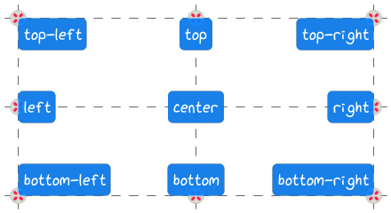

-----------
Positioning
-----------

~~~~~~
Anchor
~~~~~~

.. autoclass:: viren2d.Anchor

**Exemplary positioning of text boxes:**

The following figure shows text boxes -- see
:meth:`~viren2d.Painter.draw_textbox` --, along with the corresponding
:class:`~viren2d.Anchor`  and reference positions, which are highlighted
via :meth:`~viren2d.Painter.draw_marker`:

The code listing to create this visualization is shown in the
:ref:`tutorial section on text positioning<tutorial-text-anchors>`.

~~~~~~~~~~~~~~~~~~~~
Horizontal Alignment
~~~~~~~~~~~~~~~~~~~~

.. autoclass:: viren2d.HorizontalAlignment
   :autosummary:

**Exemplary alignment of mulit-line text:**

.. image:: ../images/text-multi-line.png
   :width: 750
   :alt: Multi-line Text Alignment
   :align: center

The code listing to create this visualization is shown in the
:ref:`tutorial section on multi-line text<tutorial-text-multi-line>`.

~~~~~~~~~~~~~~~~~~
Vertical Alignment
~~~~~~~~~~~~~~~~~~

.. autoclass:: viren2d.VerticalAlignment

~~~~~~~~~~~~~~
Label Position
~~~~~~~~~~~~~~

.. autoclass:: viren2d.LabelPosition

**Example:**

TODO add example bbox image and refer to 
:ref:`tutorial section on bounding boxes<tutorial-tracking-by-detection>`

**Corresponding Python Code:**

   TODO implement in examples/rtd/positioning

