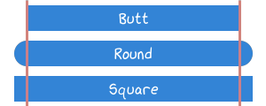

------------------
Style Enumerations
------------------

~~~~~~~~
Line Cap
~~~~~~~~

   Cheat Sheet: :class:`~viren2d.LineCap`

.. autoclass:: viren2d.LineCap

~~~~~~~~~
Line Join
~~~~~~~~~

   Cheat Sheet: :class:`~viren2d.LineJoin`

.. autoclass:: viren2d.LineJoin

~~~~~~~~~~~~~
Marker Shapes
~~~~~~~~~~~~~

.. figure:: ../images/marker-cheat-sheet.png
   :width: 600
   :alt: Supported Marker Shapes
   :align: center

   Cheat Sheet: :class:`~viren2d.Marker` Shapes

.. autoclass:: viren2d.Marker
