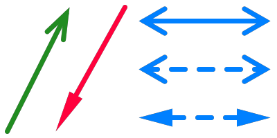
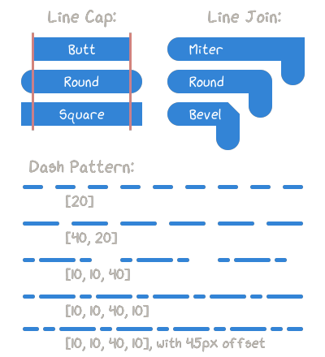

---------------
Defining Styles
---------------

~~~~~~~~~~~
Arrow Style
~~~~~~~~~~~

.. warning::
   TODO replace by the proper cheat sheet

   :class:`~viren2d.ArrowStyle` Cheat Sheet

.. autoclass:: viren2d.ArrowStyle
   :autosummary:
   :autosummary-nosignatures:
   :members:
   :inherited-members:
   :show-inheritance:
   :exclude-members: cap_offset, join_offset, Invalid

~~~~~~~~~~~~~~~~~~
Bounding Box Style
~~~~~~~~~~~~~~~~~~

.. warning::
   TODO documentation + cheat sheet

.. autoclass:: viren2d.BoundingBox2DStyle
   :autosummary:
   :autosummary-nosignatures:
   :members:

~~~~~~~~~~
Line Style
~~~~~~~~~~

   :class:`~viren2d.LineStyle` Cheat Sheet

.. autoclass:: viren2d.LineStyle
   :autosummary:
   :autosummary-nosignatures:
   :members:

~~~~~~~~~~~~
Marker Style
~~~~~~~~~~~~

.. figure:: ../images/markers.png
   :width: 600
   :alt: Supported Marker Shapes
   :align: center

   :class:`~viren2d.Marker` Shape Cheat Sheet

.. autoclass:: viren2d.MarkerStyle
   :autosummary:
   :autosummary-nosignatures:
   :members:
  

~~~~~~~~~~
Text Style
~~~~~~~~~~

.. figure:: ../images/text-anchors.png
   :width: 440
   :alt: Text positioning
   :align: center

   :class:`~viren2d.TextAnchor` Cheat Sheet

.. autoclass:: viren2d.TextStyle
   :autosummary:
   :autosummary-nosignatures:
   :members:

