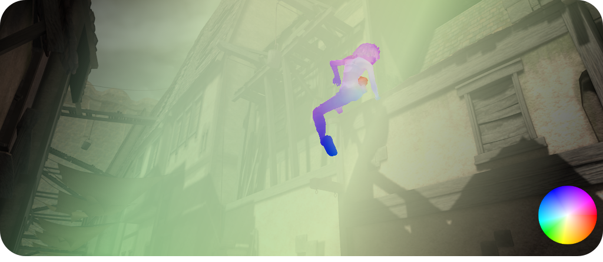

.. _tutorial-optical-flow:

-------------------------
Optical Flow Colorization
-------------------------

Optical flow fields can be visualized via
:func:`~viren2d.colorize_optical_flow`. There is also an option to illustrate
the selected color schema via :func:`~viren2d.optical_flow_legend`, to overlay
the color wheel as in the following example:

.. image:: ../images/optical-flow-color-maps.png
   :width: 600
   :alt: Exemplary optical flow visualization
   :align: center

This visualization shows a crop of the *alley2* sequence from the
`MPI SINTEL optical flow dataset <http://sintel.is.tue.mpg.de/>`__ colorized
with different cyclic color maps. Corresponding Python code:

.. literalinclude:: ../../../examples/rtd-examples-python/rtd_demo_images/optical_flow.py
   :language: python
   :emphasize-lines: 2, 12-13, 19-20
   :lines: 7-40
   :linenos:
   :dedent: 4

Using a :class:`~viren2d.ColorGradient`, colorized flow can be aesthetically
overlaid onto the input image as in the following example:

Corresponding Python code:

.. literalinclude:: ../../../examples/rtd-examples-python/rtd_demo_images/optical_flow.py
   :language: python
   :lines: 46-55
   :linenos:
   :dedent: 4