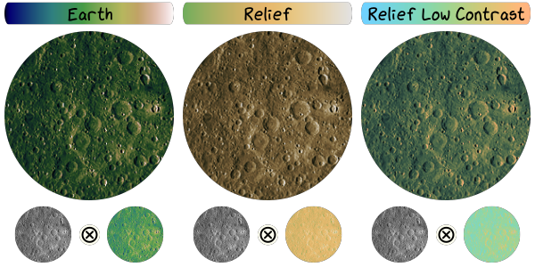

----------
Color Maps
----------

Choose any supported :class:`~viren2d.ColorMap` to colorize 2D input data via
:meth:`~viren2d.colorize` or the :class:`~viren2d.Colorizer` (for repeatedly
colorizing inputs with similar characteristics, *e.g.* when displaying a ToF
camera stream).

~~~~~~~~~~~~~~~~~~~~
Available Color Maps
~~~~~~~~~~~~~~~~~~~~

.. warning::
   TODO organize/relayout Color Map Cheat Sheet:

   .. image:: ../images/colormaps-cheat-sheet.png
      :width: 520
      :alt: Available color maps
      :align: center

~~~~~~~~~~~~~~~~~~~~
Colorization Example
~~~~~~~~~~~~~~~~~~~~

.. warning::
   TODO add example

~~~~~~~~~~~~~~
Relief Shading
~~~~~~~~~~~~~~

*Multiplicative relief shading* can be performed via
:func:`~viren2d.relief_shading`. This technique can notably enhance the
perception of shape induced by the shading:

This visualization uses different color maps suitable for relief shading to
show the topographical structure of a small part of the lunar farside. The
underlying topographical data was captured by the *Lunar Reconnaissance
Orbiter* in 2011, provided by
`NASA/GSFC/Arizona State University <https://photojournal.jpl.nasa.gov/catalog/PIA14021>`__.
Python code for this visualization example:

.. literalinclude:: ../../../examples/rtd-examples-python/rtd_demo_images/colormaps.py
   :language: python
   :emphasize-lines: 24-25, 27
   :lines: 19-72
   :linenos:
   :dedent: 4
