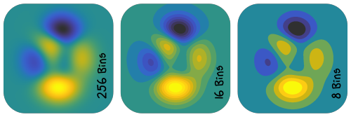

.. _tutorial-colormaps:

------------
Colorization
------------

To represent data with pseudo/false colors, select a suitable
:class:`~viren2d.ColorMap` and use the corresponding colorization technique:

*  *Scaled colorization* divides the input data range into a discrete number
   of bins and looks up the corresponding color from the color map.
   This is implemented via :func:`~viren2d.colorize_scaled`, or via the
   :class:`~viren2d.StreamColorizer`, which is suitable to repeatedly
   colorize inputs with similar characteristics, *e.g.* when displaying a ToF
   camera stream.
*  *Label or category colorization* is useful to visualize data which
   represents distinct classes or instances, such as segmentation results.
   This is implemented via :func:`~viren2d.colorize_labels`.
*  *Optical flow* can also be visualized using suitable color maps. Refer to
   the :ref:`separate tutorial page on flow visualization<tutorial-optical-flow>`.
*  *Relief shading* enhances the perception of shape, useful to represent
   topographic data. This is implemented via :func:`~viren2d.relief_shading`.
  

~~~~~~~~~~
Color Maps
~~~~~~~~~~

.. important::
   Note that **not every color map is perceptually uniform**. Always check the
   documentation of the corresponding :class:`~viren2d.ColorMap` enum value
   when selecting a suitable false color schema.
   
   Be also aware that **choosing a color map is more intricate than most people
   anticipate**. For more details, I highly recommend
   `Peter Kovesi's excellent article <https://arxiv.org/abs/1509.03700>`__
   about the caveats with color maps and how to avoid them.

..........
Sequential
..........

Sequential (*aka* linear) color maps linearly increase/decrease the lightness
and/or saturation over the color map range. They are the most generic color
maps and shoulde be used to represent data which has an intrinsic ordering.

.. image:: ../images/colormaps-cheat-sheet-sequential.png
   :width: 480
   :alt: Sequential color maps
   :align: center

...........
Categorical
...........

Categorical or quantitative maps are color palettes with distinct colors,
suitable to visualize categorical data.

.. image:: ../images/colormaps-cheat-sheet-categorical.png
   :width: 480
   :alt: Categorical color maps
   :align: center

......
Cyclic
......

Cyclic color maps begin and end at the same color. They are useful to represent
data that wraps around, *e.g.* phase angles or orientation values.

.. image:: ../images/colormaps-cheat-sheet-cyclic.png
   :width: 480
   :alt: Cyclic color maps
   :align: center

.......................
Color Vision Deficiency
.......................

These color maps are suitable for viewers with color vision deficiency (CVD).
The colors are chosen such that people who are color blind should share a
common perceptual interpretation of data with people who have normal color
vision.

.. image:: ../images/colormaps-cheat-sheet-color-blind.png
   :width: 480
   :alt: Color maps suitable for the color-blind
   :align: center

.........
Diverging
.........

Diverging color maps are suitable to represent values above or below a defined
reference value. Note that these maps usually have a small perceptual flat spot
at the center.

.. image:: ../images/colormaps-cheat-sheet-diverging.png
   :width: 480
   :alt: Categorical color maps
   :align: center

.......
Rainbow
.......

Rainbow color maps are widely used but also too often misused. They require
special care as they can **easily lead to perception of features that are not
present** in the data and also suffer from **blind spots** (where the viewer
cannot distinguish actually present features).

These issues can be seen for example at the *jet* color gradient below, which
shows banding effects. For further details, refer to the summary
provided on `Peter Kovesi's website <https://colorcet.com/>`__.

.. image:: ../images/colormaps-cheat-sheet-rainbow.png
   :width: 480
   :alt: Rainbow color maps
   :align: center

...............
Special Purpose
...............

These color maps are often designed for a particular purpose, such as
representing thermographic (``thermal``), topographic (``earth``, ``ocean``,
*etc.*), or multi-spectral (``spectral``) data.

.. image:: ../images/colormaps-cheat-sheet-specialized.png
   :width: 480
   :alt: Specialized color maps
   :align: center

~~~~~~~~~~~~~~~~~~~
Scaled Colorization
~~~~~~~~~~~~~~~~~~~

Scaled colorization divides the data range into a discrete number of evenly
spaced bins which are then used to look up the corresponding color from a
color map. The following example uses the
`Gouldian color map <https://colorcet.com/>`__ to colorize the 
`peaks example data <https://www.mathworks.com/help/matlab/ref/peaks.html>`__:

Corresponding Python code:

.. literalinclude:: ../../../examples/rtd-examples-python/rtd_demo_images/colormaps.py
   :language: python
   :emphasize-lines: 1, 13-14
   :lines: 78-104
   :linenos:
   :dedent: 4

~~~~~~~~~~~~~~~~~~
Label Colorization
~~~~~~~~~~~~~~~~~~

Label images, such as the results of semantic, panoptic or instance segementation, should
not be colorized by dividing the input data range into a discrete number of
bins. Instead, use :func:`~viren2d.colorize_labels` which will properly
alternate between the colors:

This visualization shows class- and instance-level annotations from
a crop of the `Cityscapes training dataset <https://www.cityscapes-dataset.com/>`__.
Corresponding colorization code:

.. literalinclude:: ../../../examples/rtd-examples-python/rtd_demo_images/colormaps.py
   :language: python
   :emphasize-lines: 13-14, 27-28
   :lines: 115-151
   :linenos:
   :dedent: 8

~~~~~~~~~~~~~~
Relief Shading
~~~~~~~~~~~~~~

*Multiplicative relief shading* can be performed via
:func:`~viren2d.relief_shading`. This technique can notably enhance the
perception of shape induced by the shading:

.. image:: ../images/relief-shading.png
   :width: 600
   :alt: Exemplary relief shading
   :align: center

This visualization uses relief shading with different color maps to
show the topographic structure of (a small part of) the lunar farside. The
underlying topographic data was captured by the *Lunar Reconnaissance
Orbiter* in 2011 and published by
`NASA/GSFC/Arizona State University <https://photojournal.jpl.nasa.gov/catalog/PIA14021>`__.
The smaller images below each main visualization show the inputs to
:func:`~viren2d.relief_shading`, *i.e.* the relief and its colorization.
Note how the two isoluminant relief color maps are not useful on their own, but
induce a proper shape perception after shading.
Python code for this visualization example:

.. literalinclude:: ../../../examples/rtd-examples-python/rtd_demo_images/colormaps.py
   :language: python
   :emphasize-lines: 23-24, 26
   :lines: 20-72
   :linenos:
   :dedent: 4
