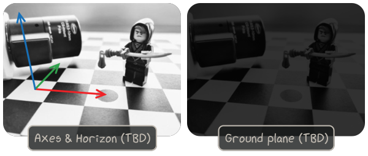

~~~~~~~~~~~~~~~
Camera Geometry
~~~~~~~~~~~~~~~

.. warning::
   TODO doc

To inspect the results of a pinhole camera calibration, ``viren2d`` provides
the following utilities:

* Overlaying coordinate system axes via :func:`~viren2d.Painter.draw_xyz_axes`.

* TODO ground plane

* TODO horizon

This visualization has been created with the following Python code:

.. literalinclude:: ../../../examples/rtd-examples-python/rtd_demo_images/pinhole.py
   :language: python
   :emphasize-lines: 24-26
   :lines: 6-
   :linenos:
