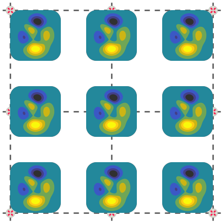

~~~~~~~~~~~~~~
Image Overlays
~~~~~~~~~~~~~~

Images can be superimposed onto the canvas via :meth:`~viren2d.Painter.draw_image`.
If only a sub-region *region of interest* should be overlaid, this can be selected via
:meth:`~viren2d.ImageBuffer.roi`.

To position an image, you simply need a **reference position** (*i.e. x* and
*y* coordinate) and choose a proper :class:`~viren2d.Anchor`. This example
uses the `"gouldian" color map <https://colorcet.com/>`__ to colorize example
data computed by the well-known
`peaks function <https://www.mathworks.com/help/matlab/ref/peaks.html>`__:

.. literalinclude:: ../../../examples/rtd-examples-python/rtd_demo_images/images.py
   :language: python
   :linenos:
   :lines: 52-75
   :emphasize-lines: 14-17
   :dedent: 4

.. warning::
   TODO example
