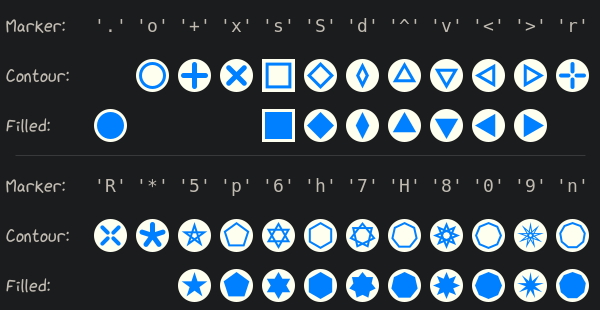

.. _tutorial-markers:

~~~~~~~~~~~~~~~~~~~
Markers & Keypoints
~~~~~~~~~~~~~~~~~~~

Highlight locations via :meth:`~viren2d.Painter.draw_marker` or
:meth:`~viren2d.Painter.draw_markers`.

**Marker Shape Cheat Sheet:**

This visualization has been created with the following Python code:

.. literalinclude:: ../../../examples/rtd-examples-python/rtd_demo_images/markers.py
   :language: python
   :emphasize-lines: 2-4, 51, 56
   :lines: 12-75
   :linenos:
   :dedent: 4
