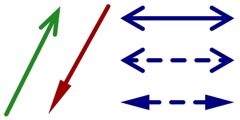
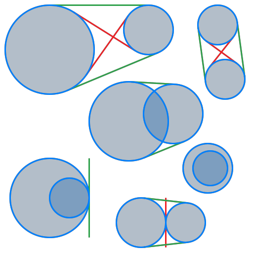

.. include:: ../symbols.rst

~~~~~~~~~~~~
Basic Shapes
~~~~~~~~~~~~

This tutorial section shows some selected shapes & primitives with their
corresponding code examples. For a detailed listing of supported shapes, refer
to the :class:`~viren2d.Painter`'s API documentation.

.. _tutorial-draw-arrows:

......
Arrows
......

Arrow shapes can easily be customized:

.. literalinclude:: ../../../examples/rtd-examples-python/rtd_demo_images/primitives.py
   :language: python
   :lines: 70-92
   :emphasize-lines: 5, 10, 16, 19, 23
   :linenos:
   :dedent: 4

.. _tutorial-draw-circles:

...............
Circles & Lines
...............

The following example shows basic line & circle drawings:

This example is C++ only, because ``viren2d`` focuses on visualization and
thus, does not provide Python bindings for the tangent computation. This
geometric functionality is available in C++ via the
`werkzeugkiste::geometry library <https://github.com/snototter/werkzeugkiste>`__:

.. literalinclude:: ../../../examples/demo-cpp/demo_utils/demos_shapes.cpp
   :language: cpp
   :lines: 13-101
   :emphasize-lines: 21, 38, 42-47
   :linenos:

.. _tutorial-draw-ellipses:

........
Ellipses
........

Both ellipses and elliptical arcs are supported:

|image-ellipse-examples|

.. literalinclude:: ../../../examples/rtd-examples-python/rtd_demo_images/primitives.py
   :language: python
   :lines: 13-60
   :linenos:
   :dedent: 4
   :emphasize-lines: 12, 19, 29, 39, 43, 48

.. _tutorial-draw-rects:

..........
Rectangles
..........

Rectangles can be drawn in a variety of configurations:

|image-rect-examples|

.. literalinclude:: ../../../examples/rtd-examples-python/rtd_demo_images/primitives.py
   :language: python
   :lines: 108-134
   :linenos:
   :dedent: 4
   :emphasize-lines: 7, 10, 15, 18, 24, 27
