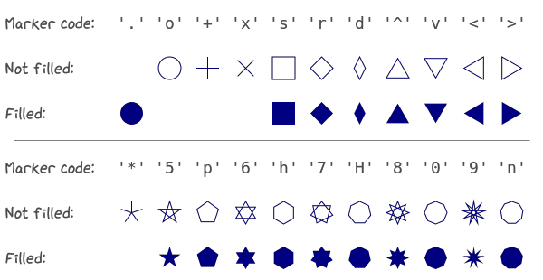

Markers & Keypoints
~~~~~~~~~~~~~~~~~~~
Highlight locations via :meth:`viren2d.Painter.draw_marker` or
:meth:`viren2d.Painter.draw_markers`.

**Example:**

   Supported marker shapes.

Python code to create this visualization:

.. literalinclude:: ../../../examples/rtd_demo_images/markers.py
   :language: python
   :emphasize-lines: 12, 13, 30, 33, 37

Geometric Primitives
~~~~~~~~~~~~~~~~~~~~

TODO arc, circle
................

.. function:: Draw arcs
   :noindex:
   
   TODO display image, include code to generate the example

.. code-block:: python
   :caption: Python API
   :emphasize-lines: 3, 6, 7

   painter.draw_arc(...)
   painter.draw_arc(...)
   painter.draw_arc(...)
   painter.draw_arc(...)
   painter.draw_arc(...)

   painter.draw_circle(...)

Ellipse
.......

TODO

Rectangle
.........

TODO

