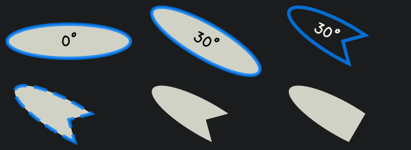

~~~~~~~~~~~~
Basic Shapes
~~~~~~~~~~~~

This tutorial section shows some selected shapes & primitives with their
corresponding code examples. For a detailed listing of supported shapes, refer
to the :class:`~viren2d.Painter`'s API documentation.

.. _tutorial-draw-arrows:

......
Arrows
......

Arrow shapes can easily be customized:

.. image:: ../images/arrows.png
   :width: 400
   :alt: Arrows
   :align: center

.. literalinclude:: ../../../examples/rtd-examples-python/rtd_demo_images/primitives.py
   :language: python
   :lines: 71-96
   :emphasize-lines: 8, 13, 19, 22, 26
   :linenos:
   :dedent: 4

.. _tutorial-draw-ellipses:

........
Ellipses
........

Both ellipses and elliptical arcs are supported:

.. literalinclude:: ../../../examples/rtd-examples-python/rtd_demo_images/primitives.py
   :language: python
   :lines: 13-61
   :linenos:
   :dedent: 4
   :emphasize-lines: 13, 20, 30, 40, 44, 49

.. _tutorial-draw-rects:

..........
Rectangles
..........

Rectangles can be drawn in a variety of configurations:

.. figure:: ../images/rectangles.png
   :width: 600
   :alt: Exemplary rectangles
   :align: center

.. literalinclude:: ../../../examples/rtd-examples-python/rtd_demo_images/primitives.py
   :language: python
   :lines: 112-138
   :linenos:
   :dedent: 4
   :emphasize-lines: 7, 10, 15, 18, 24, 27
