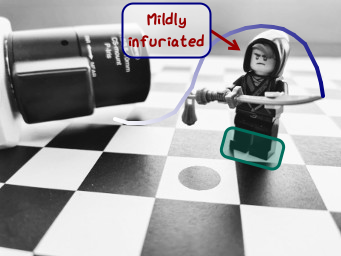

Text
~~~~

TODO

.. important::
   Use rounded corners...
   painter.draw_circle(...)
   painter.draw_circle(...)
   painter.draw_circle(...)

.. code-block:: cpp
   :caption: C++ API
   :emphasize-lines: 2

   auto line_style = viren2d::LineStyle();
   painter->DrawArc(...);
   painter->DrawCircle(...);

   TODO boxes + text
