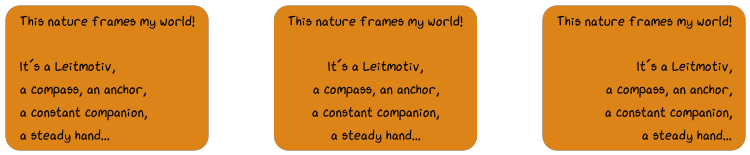

~~~~~~~~~~~~~~~~~
Text & Text Boxes
~~~~~~~~~~~~~~~~~

Text can be rendered via :meth:`viren2d.Painter.draw_text` or
:meth:`viren2d.Painter.draw_textbox`.

**Example Multi-Line Text Boxes:**

     
   Thise figure shows the different (horizontal) alignment options of
   multi-line text boxes. The displayed text lines are an excerpt from
   `Revelation, a Visual Poem <https://vimeo.com/57370112>`__.

**Corresponding Python Code:**

.. literalinclude:: ../../../examples/rtd_demo_images/positioning.py
   :language: python
   :lines: 59-105
   :linenos:
   :emphasize-lines: 25-29

