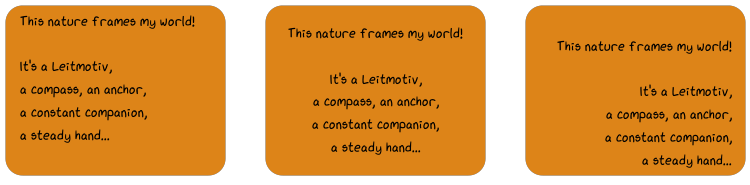

.. include:: ../symbols.rst
   
.. _tutorial-text:

~~~~~~~~~~~~~~~~~
Text & Text Boxes
~~~~~~~~~~~~~~~~~

Text can be rendered via :meth:`~viren2d.Painter.draw_text` or
:meth:`~viren2d.Painter.draw_text_box`.

.. _tutorial-text-anchors:

................
Text Positioning
................

To position text on the canvas, you simply need a **reference position**
(*i.e.* :math:`x`` and :math:`y` coordinate) and an :class:`~viren2d.Anchor`.
The following example shows text boxes along with the corresponding anchor
and reference positions.
These reference positions are highlighted via
:func:`~viren2d.Painter.draw_marker`:

|image-cheat-sheet-anchors|

Corresponding Python code:

.. literalinclude:: ../../../examples/rtd-examples-python/rtd_demo_images/text.py
   :language: python
   :linenos:
   :lines: 35-51
   :emphasize-lines: 9-12
   :dedent: 4

.. _tutorial-text-multi-line:

...............
Multi-Line Text
...............

The following example shows the different alignment options of multi-line text
boxes. These lines are an excerpt from
`Revelation, a Visual Poem <https://vimeo.com/57370112>`__.

This visualization has been created with the following Python code:

.. literalinclude:: ../../../examples/rtd-examples-python/rtd_demo_images/text.py
   :language: python
   :lines: 64-98
   :linenos:
   :emphasize-lines: 15-17, 23-24, 30-31
   :dedent: 4
