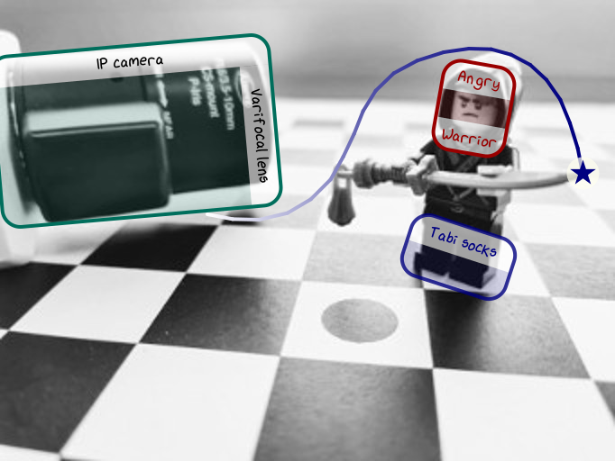

.. _tutorial-tracking-by-detection:

~~~~~~~~~~~~~~~~~~~~~~~~~~~~~
Bounding Boxes & Trajectories
~~~~~~~~~~~~~~~~~~~~~~~~~~~~~

Tracking-by-detection results can be visualized via
:meth:`~viren2d.Painter.draw_bounding_box_2d` and
:meth:`~viren2d.Painter.draw_trajectory`. For example:

This visualization has been created with the following Python code:

   .. literalinclude:: ../../../examples/rtd_demo_images/tracking_by_detection.py
      :language: python
      :lines: 11-76
      :emphasize-lines: 7, 17-20, 39-42
      :linenos:
      :dedent: 4
