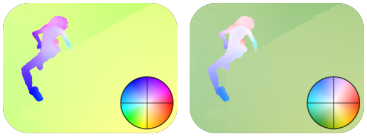

------------
Optical Flow
------------

Optical flow fields can be visualized via
:func:`~viren2d.colorize_optical_flow`. There is also an option to illustrate
the selected color schema via :func:`~viren2d.optical_flow_legend`, to overlay
the color wheel as in the following example:

..
   TODO example shows part of sintel alley2 with different color maps
   TODO add code snippet
